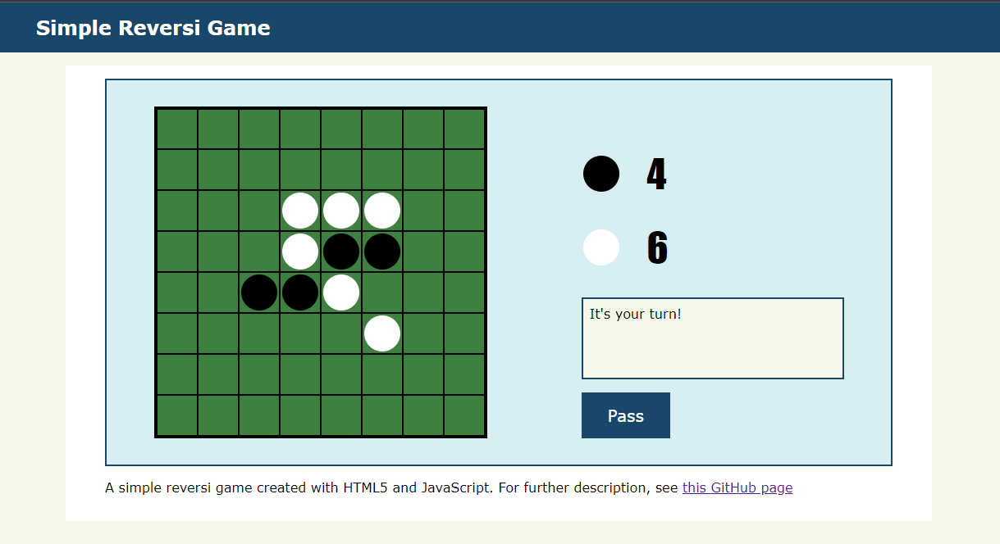
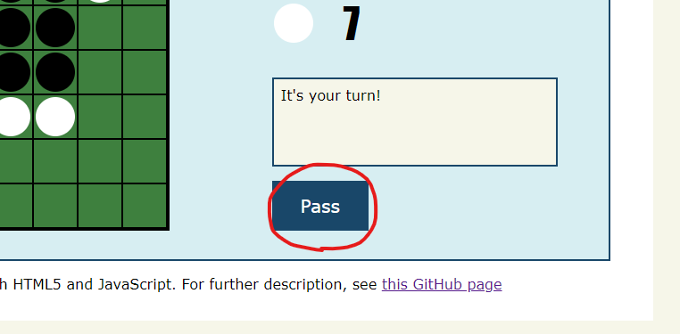
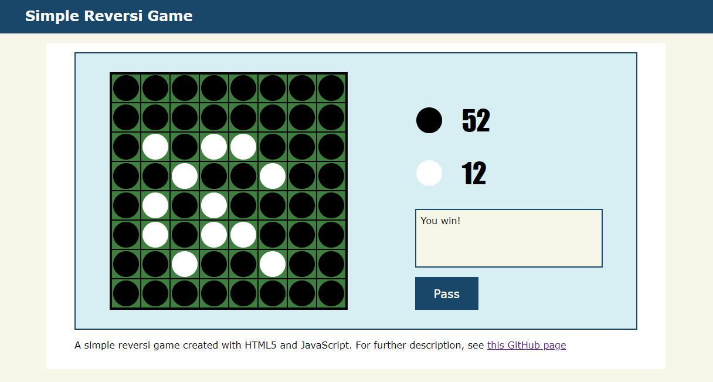

# Simple Reversi Game
A simple reversi game built with HTML5 and JavaScript.
You can play it on [this page](https://danook.github.io/simple_reversi/).

## Technologies / Languages
* HTML5
* CSS3
* JavaScript

## How To Play
The screen of the game looks like this.

The dark player is you and the light one is the computer. You can click on the square you want to put a disk on, and the board will automatically renewed (i.e. a black disk will be placed and white disks will be reversed). 

After a while, the computer chooses the space to put a disk and places a white disk there. After that it's your turn again, and you and the computer place a disk alternately like this.

Both players' scores (i.e. the number of disks) are displayed beside or below the grid.

### When You Want To Pass
If there is no space you can place a disk on, you can pass your turn by pressing the "Pass" button beside or below the board.

Please note that you cannot pass your turn if there is a space you can place a disk on; In that case, a message saying "Cannot pass" will appear.

### When The Game Finishes
The game finishes when
1. The grid is filled
2. You and the computer pass the turn continuously (This means neither you nor the computer can place a disk anymore)

When it finishes, a message appears over the board which tell you the result of the game (this can be "You win", "You lose" or "Draw").

### How Computer Chooses a Place To Put a Disk
The computer is using minimax algorithm to decide where to put a disk.
For minimax algorithm, see [this page](https://en.wikipedia.org/wiki/Minimax).